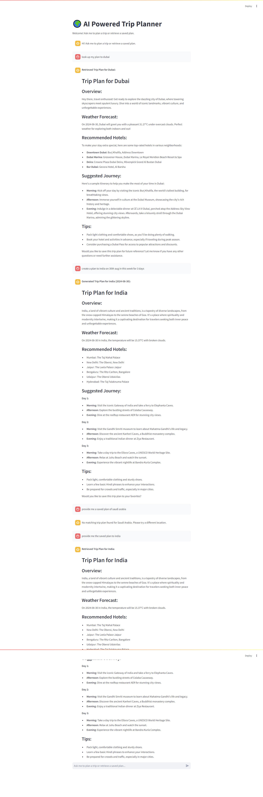

# AI Powered Trip Planner Web App

Welcome to the AI Powered Trip Planner! This app helps you plan trips using AI and provides weather and accommodation recommendations.

## Getting Started

Follow these steps to get the project up and running:

### 1. Clone the Repository

**Use CLI**

- git clone https://github.com/muhammadbilal345/AI-powered-trip-planner.git

### 2. Set Up Your Environment
Create a virtual environment and activate it:

**Use CLI**
- python -m venv venv
- source venv/bin/activate  # On Windows: venv\Scripts\activate

Install the required packages:

**Use CLI**
- pip install -r requirements.txt

### 3. Get API Keys
Get an API keys from the following links:

- Gemini Pro API: https://aistudio.google.com/app/apikey
- Weather API: https://openweathermap.org/api
- Hotel API: https://rapidapi.com/datastore/api/skyscanner80

### 4. Configure Environment Variables
Create a .env file in the root directory and add your API key:

- GOOGLE_API_KEY = your_google_api_key
- OPEN_WEATHER_MAP_KEY = open_weather_map_key
- SKY_SCANNER_KEY = sky_scanner_key

### 5. Run the Application
Start the Streamlit app:

**Use CLI**
- streamlit run src/main.py

Open your browser and go to http://localhost:8501 to use the app!

**How to Use:**
- Plan a Trip: Ask the app to help plan a trip by providing instructions with location and date.
- Retrieve Plans: Check if you have saved plans by specifying the location.

